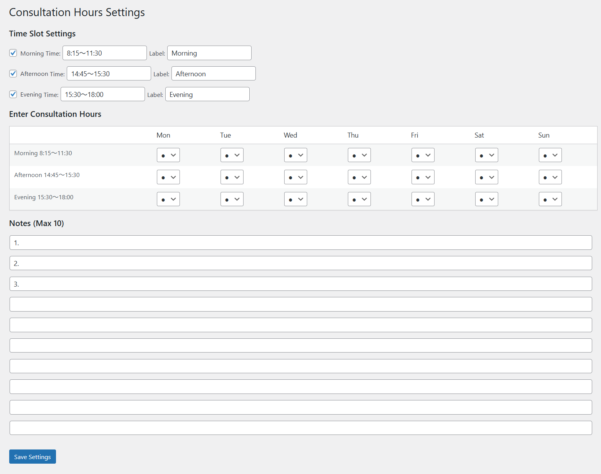
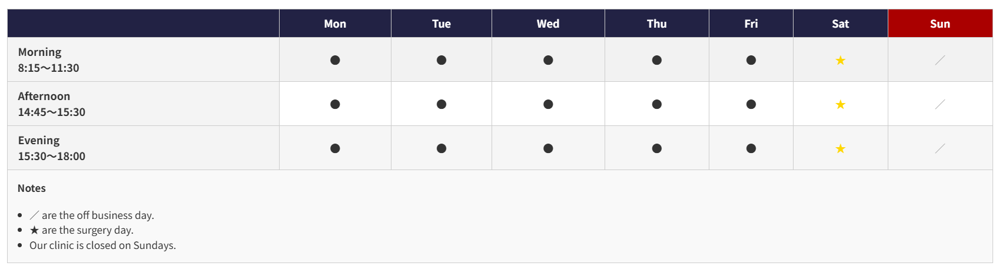

# consultation-hours

小さな病院やクリニック向けに、診療時間のお知らせと管理を簡単に行える WordPress プラグインです。

## 🩺 特長

- 直感的なUIで、診療時間の設定・変更が可能
- 備考欄も含めた柔軟な情報入力に対応
- ウィジェットやショートコードで簡単に表示
- モバイル表示にも最適化済み
- 完全日本語対応

## 🔧 使用方法

1. WordPress 管理画面の「プラグイン」から `consultation-hours` をインストール＆有効化
2. 管理画面左の「診療時間」メニューから設定を行ってください
3. 投稿・固定ページなどに `[consultation_hours]` を挿入することで表示されます

## 📸 スクリーンショット

  
*管理画面の診療時間設定画面*

  
*フロントエンドでの表示例*

## 💬 よくある質問

### Q. 特定曜日だけ休診にできますか？
A. はい、曜日ごとに診療有無を個別に設定可能です。

### Q. 表示をカスタマイズできますか？
A. CSSでスタイル調整が可能です。将来的にテンプレート機能も検討中です。

## 📥 ダウンロード

WordPress公式ページ:  
[https://ja.wordpress.org/plugins/consultation-hours/](https://ja.wordpress.org/plugins/consultation-hours/)

## 🪪 ライセンス

This plugin is licensed under the GNU General Public License v2.0 or later.  
See [LICENSE](./LICENSE) for details.
